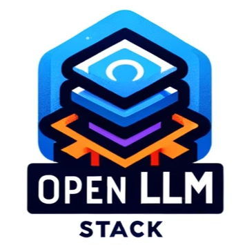

# Open LLM Stack

Welcome to the Open LLM Stack repository! This project is dedicated to help companies in building production-ready Generative AI applications, with a keen focus on infrastructure management. Open LLM Stacks are built using open technologies, like Hugging Face Text Generation Inference, MongoDB, HuggingChat, Langchain, vLLM, Open Search, and more. The repository includes examples of how to deploy popular use cases to different cloud providers or on-premise.
Leveraging the power of open technologies like Hugging Face Text Generation Inference, MongoDB, HuggingChat, Langchain, vLLM, Open Search, and more, Open LLM Stack offers a robust and versatile foundation for your Generative AI needs.

##  Overview

| Use Case | Description | Cloud Providers | Stack |
|----------|-------------|-----------------|------------|
| [open ChatGPT with HuggingChat]() | ChatGPT alternative powered by Open Source | AWS, On-Premise | Text-Generation-Inference, MongoDB, HuggingChat |
| ...      | ...         | ...             | ...        |

## Getting Started

To get started with Open LLM Stack, please follow these steps:

1. **Installation**: Clone the repository and install necessary dependencies.
2. **Configuration**: Follow the configuration guidelines for each technology stack component.
3. **Deployment**: Deploy your application to the desired platform.

Detailed instructions are available in the respective directories.

## License

Open LLM Stack is released under the [Apache 2.0](./LICENSE). Please refer to the `LICENSE` file for more details.

## Contributing

We welcome contributions to the Open LLM Stack! If you're interested in contributing, please:

1. Fork the repository.
2. Create a new branch for your feature or fix.
3. Submit a pull request with a clear description of your changes.

Please read our `CONTRIBUTING` guide for detailed instructions on how to contribute.

## Support and Contact

For support, questions, or feedback, please open an issue in the repository.

---

Thank you for exploring the Open LLM Stack. We are excited to see what you build with it!
